  <picture>
    <source media="(prefers-color-scheme: dark)" srcset="./dark.svg">
    <source media="(prefers-color-scheme: light)" srcset="./light.svg">
    
  </picture>

  
  
  
  

---

# Hi, I'm Alferid Zeinu

Software Engineer focused on building modern web, backend, and mobile applications.

- 🔭 **Current Focus**: Full Stack Development with TypeScript, React, Node.js, and Flutter.
- 🛠️ **Core Expertise**: Web Architecture, Cross-Platform Mobile Engineering, and Scalable APIs.
- 🌐 **Portfolio**: [alferidsportifolio.com](https://alferidsportifolio.com/)
- 🐈 **GitHub**: [@fe-rid](https://github.com/fe-rid/)

---

### 🛠️ Tech Stack & Tooling

<table>
  <tr>
    <td width="22%"><b>Languages</b></td>
    <td>
      
      
      
      
      
      
      
      
    </td>
  </tr>
  <tr>
    <td><b>Frontend &amp; Mobile</b></td>
    <td>
      
      
      
      
      
      
      
    </td>
  </tr>
  <tr>
    <td><b>Backend &amp; Cloud</b></td>
    <td>
      
      
      
      
      
      
    </td>
  </tr>
  <tr>
    <td><b>Tools &amp; Workflow</b></td>
    <td>
      
      
      
      
      
      
    </td>
  </tr>
</table>

---

### 🚀 Featured Projects

| Project | Description | Tech Stack | Link |
| :--- | :--- | :--- | :--- |
| **📱 HandyConnect** | Cross-platform on-demand mobile application connecting clients with local service providers. | `Flutter` `Dart` `Firebase` | [GitHub](https://github.com/fe-rid/handyConnect) |
| **📖 Adhkar Tracker** | Daily remembrance and spiritual habit tracking mobile application with clean interface. | `Flutter` `Dart` | [GitHub](https://github.com/fe-rid/adhkar_tracker) |
| **🛒 Uni Gebeya** | University e-commerce and delivery platform designed for campus community transactions. | `Flutter` `Node.js` | [GitHub](https://github.com/fe-rid/uni_delivery_app) |
| **💰 Expense Tracker** | Comprehensive personal financial tracking application with expense analytics and management. | `React` `TypeScript` | [GitHub](https://github.com/fe-rid/expenseTracker) |
| **✈️ Travel with Mercy** | Modern travel and tour booking web platform showcasing curated destination experiences. | `React` `TypeScript` `TailwindCSS` | [Live Demo](https://travel-with-mercyy.vercel.app/) |

---

### 📊 GitHub Activity

  
  

---

  <a href="https://github.com/fe-rid/"><b>@fe-rid</b></a> • <a href="https://alferidsportifolio.com/"><b>alferidsportifolio.com</b></a>

